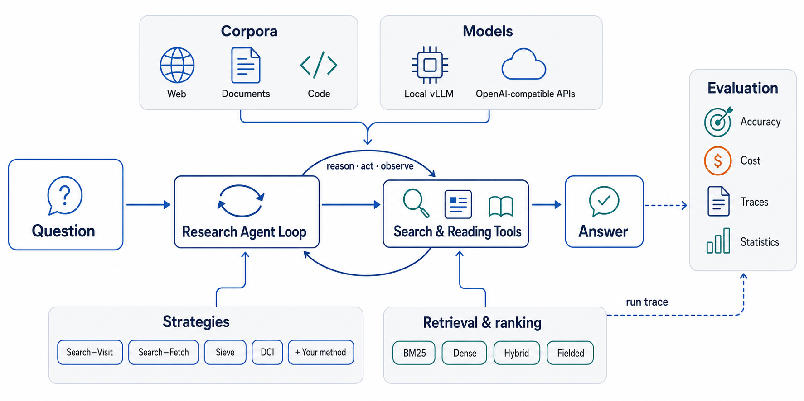

<div align="center">

# SkimSearchAgent

**A research framework for deep-search agents. Change one component, keep the rest of the experiment fixed.**

[](https://github.com/ielab/skim-search-agent/actions/workflows/ci.yml)
[](#install)
[](LICENSE)

[Project page](https://ielab.github.io/skim-search-agent/) ·
[Paper](https://arxiv.org/abs/2608.02751) ·
[Install](#install) · [Run an experiment](#run-an-experiment) · [Change one thing](#change-one-thing) ·
[Python API](#python-api) · [Strategies](#strategies) · [Train a retriever](#train-a-retriever) ·
[Docs](#documentation)

</div>

<p align="center">
  
</p>

A deep-search agent answers a question by searching a collection over several steps. Which
retriever it uses, what a search result shows, how it reads a document, which model drives it,
and how the answer is scored are separate decisions. SkimSearchAgent makes each one a component
with a fixed interface and runs every combination through the same harness, so two experiments
differ only where you changed them. Every run writes the same record: the full trajectory, the
configuration, and the metrics.

## Install

```bash
git clone https://github.com/ielab/skim-search-agent.git && cd skim-search-agent
python -m pip install -e .                 # core: PyYAML only
python -m pip install -e ".[api]"          # OpenAI, Gemini, OpenAI-compatible servers
python -m pip install -e ".[retrieval]"    # Lucene BM25, dense and hybrid retrieval (Java 21+, torch)
```

Other extras: `eval` (dataset staging, statistics), `serve` (vLLM), `demo-live`, `dev`
(tests), `train` (retriever training, separate environment), `all`. Pins match
[`requirements.txt`](requirements.txt), the environment used for the paper.

## Run an experiment

One YAML file is one complete setting. The file lists every knob its strategy reads: dataset,
model, token budgets, listing depths, retrieval engines, scoring, output. A `search_visit` file
has no dense-model keys; a `sieve` file has no listing depths.

```bash
skimsearchagent run configs/smoke_doc_fixture_sieve_bm25.yaml        # scripted policy, no keys
export OPENAI_API_KEY=...
skimsearchagent run configs/doc_fixture_sieve_bm25_gpt4omini.yaml    # a real model
skimsearchagent run configs/paper/hotpotqa_structured_sieve.yaml     # the paper's setting
skimsearchagent run configs/paper/hotpotqa_structured_sieve.yaml model.name=gpt-4o output.runs_dir=runs/gpt4o
skimsearchagent validate configs/paper/hotpotqa_structured_sieve.yaml   # what it needs, what it will run
skimsearchagent template paper sieve > configs/mine.yaml              # a complete file for one strategy, to edit
```

The run directory holds `config.json` (the file's content plus every resolved knob),
`rows.jsonl` (one full trajectory per question) and `results.json` (metrics). Rerunning the same
command resumes. Rerunning a different setting into the same directory is refused.

For one-off runs every knob is also a `key=value` argument:

```bash
skimsearchagent dataset=doc_fixture strategy=search_visit model=gpt-4o-mini snippet_tokens=64
```

## Change one thing

Each block below changes exactly one component. Everything else stays the same.

**The strategy** (one word in the config, or on the command line):

```yaml
strategy: search_visit        # sieve, sieve_bm25, search_fetch, autoread, dci, indri, ... (see Strategies)
```

**The model** (any OpenAI-compatible server, OpenAI, Gemini, or in-process vLLM):

```yaml
model:
  name: Alibaba-NLP/Tongyi-DeepResearch-30B-A3B
  backend: api                # a served model
  api_base: http://localhost:8000/v1
```

**A budget** (all budgets are token counts):

```yaml
budgets:
  max_visit_tokens: 12000     # whole-document read cap
  snippet_tokens: 64          # result-card snippet width
agent:
  max_steps: 100
```

**ITER's search tools** (de-duplicated `search`, `get_document` by id) with ITER's released retriever:

```yaml
strategy: dedup_dense         # or dedup_bm25
retrieval:
  dense_model: ielabgroup/ITER-Qwen3-Embedding-0.6B
  dense_query_style: i2       # the query carries the earlier sub-queries, as the model was trained
  dense_query_instruction: "Given the main question, the current sub-query, and the sub-queries already tried in previous interactions, retrieve documents relevant to the current sub-query that provide NEW information not yet found."
```

**A corpus that does not fit in memory** (served from disk, searched through prebuilt indexes, nothing encoded during the run):

```yaml
dataset:
  name: infoseek_eval         # data/infoseek_eval/topics.tsv over data/corpora/wiki25_512/corpus.jsonl (11.2M chunks)
retrieval:
  dense_index: indexes/external/iter06b_wiki25_512   # index.faiss + index.lookup.pkl, ITER's layout
  bm25_index: indexes/external/wiki25_512_lucene     # for dedup_bm25 / search_visit with bm25_backend: pyserini
```

**The corpus**, from Python, with your own documents:

```python
from agent_search import research

docs = [{"_id": "d1", "title": "Treaty of Guadalupe Hidalgo",
         "text": "The Treaty of Guadalupe Hidalgo ended the Mexican-American War in 1848."}]
result = research("Which treaty ended the Mexican-American War?", docs,
                  strategy="sieve_bm25", model="gpt-4o-mini")
print(result.answer, result.ranking, result.usage)
```

**The model, from Python**, as any callable that maps chat messages to text:

```python
def my_model(messages: list[dict]) -> str:
    return my_client.chat(messages)          # returns the generation, tool calls included

research(question, docs, strategy="sieve_bm25", generate=my_model)
```

**The prompt**: edit `agent_search/prompts/tasks/research.md`, or point a condition at your
own template file:

```python
from agent_search.prompts.registry import register_condition
register_condition("my_sieve", task="/path/to/my_task.md", toolset="search_fetch_s")
# run it: strategy=agent_my_sieve
```

**A tool** (declare it, implement it, bind it to a condition):

```python
from agent_search.prompts.loader import register_tool, register_toolset
from agent_search.prompts.registry import register_condition
from agent_search.agent.retriever import register_workspace
from agent_search.core import OrderedSeen

register_tool("title_lookup", description="Documents whose title contains the words.",
              parameters={"type": "object", "properties": {"words": {"type": "string"}}, "required": ["words"]})
register_toolset("title_only", ["title_lookup"])
register_condition("title_agent", task="research", toolset="title_only")

class TitleWorkspace:
    tools = ("title_lookup",)
    def __init__(self, ctx):                      # ctx.units, ctx.ubyid, ctx.bm25(), ctx.bql(), ctx.dense()
        self.units, self.seen = ctx.units, OrderedSeen()
    @property
    def surfaced(self): return list(self.seen)    # the agent's retrieval ranking
    def run(self, name, args):
        hits = [u for u in self.units if all(w in (u.title or "").lower() for w in args["words"].lower().split())]
        self.seen.update(u.doc_id for u in hits)
        return "\n".join(f"{u.doc_id}  {u.title}: {u.body}" for u in hits) or "no match"

register_workspace("title_arm", tools=("title_lookup",), builder=TitleWorkspace)
# run it: strategy=agent_title_agent
```

**A retriever**:

```python
from agent_search.core import Retriever
from agent_search.retrievers.registry import register

class MyRetriever(Retriever):
    name = "my_method"
    def index(self, units, key=None): self._ids = [u.doc_id for u in units]; return self
    def search(self, query, k): return self._ids[:k]

register("my_method")(lambda cfg, name: (lambda: MyRetriever()))
# run it: strategy=my_method (retrieval-only), or call it from a workspace
```

**The dense model** (one setting covers Sieve's ranker, its fallback, and every dense baseline):

```yaml
retrieval:
  dense_model: models/my-retriever     # a hub id or a checkpoint trained below
  dense_query_style: i2                # how the query is written from the agent's history
```

**A dataset**:

```python
from agent_search.evaluation.datasets import Instance, register_dataset

@register_dataset("my_qa", domain="general")
def load_my_qa(limit=None, corpus_limit=None):
    return [Instance(instance_id="my_qa__1", repo="local/my_qa", base_commit="0" * 40,
                     problem_statement="Which treaty ended the Mexican-American War?", patch="",
                     docs=docs, gold_doc_ids={"d1"}, answer="Treaty of Guadalupe Hidalgo", corpus_id="my_qa")]
# run it: dataset=my_qa
```

Registrations in an installed package load through the `skimsearchagent.plugins` entry-point
group or `SKIMSEARCHAGENT_PLUGINS=my_module`. [docs/EXTENDING.md](docs/EXTENDING.md) has the
complete version of each block, including metrics and judges.

## Python API

```python
from agent_search import research, build_agent

result = research(question, docs, strategy="sieve_bm25", model="gpt-4o-mini")
result.answer        # the answer span
result.ranking       # documents surfaced, in first-seen order
result.steps         # per step: tool, arguments, full observation, tokens, hit_ids, read_ids
result.usage         # llm_calls, prompt, completion and cached tokens

agent = build_agent("sieve_bm25", model="gpt-4o-mini")   # reuse one index for many questions
agent.index(units, key="my_corpus")
agent.search(question, k=10)
```

## Strategies

| family | `strategy=` | what the agent does |
|---|---|---|
| Retrieval-only | `bm25`, `bm25_lucene`; `dense`, `bql`, `grep` by retriever name | rank once, no agent loop |
| Search–Visit | `search_visit`, `search_visit_dense`, `search_visit_hybrid` | read a result list, open whole documents |
| Search–AutoRead | `autoread`, `autoread_dense` | every search returns full text |
| Direct corpus interaction | `dci`, `bounded_dci` | shell commands over exported files, optionally within a BM25 working set |
| Search–Fetch | `search_fetch`, `search_fetch_dense`, `search_fetch_hybrid` | result cards with snippets, then named sections |
| **Sieve** | `sieve`, `sieve_bm25`, `sieve_dense`, `sieve_nosnip` | BQL candidate filtering, one ranking model, result cards, section fetch |
| Structured control | `indri` | Indri-QL retrieval with cards and section fetch |
| Code localization | `codefix`, `codefix_grep`, `codefix_patch` | search or grep a repository, read functions, propose a fix (`dataset=code_fixture`) |
| ITER search | `dedup_bm25`, `dedup_dense` | ITER's tool setup: keyword search that hides documents surfaced earlier (listed under "Already-seen"), then `get_document` by id |

Dense strategies need an embedding cache built once per dataset
(`skimsearchagent-build-indexes --dataset <name> --retriever dense`). Lucene backends need Java
21+ and their own index. A missing artifact stops the run before the first step and prints the
build command.

A corpus too large for memory (ITER's 11.2M-chunk Wikipedia) is served from disk: the loader
switches to an on-disk document store above 1 GiB, and retrieval goes through prebuilt indexes
named in the file (`retrieval.dense_index` for a FAISS index, `retrieval.bm25_index` for a
Lucene one). Nothing is encoded during a run. See `configs/iter/` and docs/TRAINING.md
section 5.

## Train a retriever

Every run is a trajectory, so it is also training data. The ITER recipe (history-conditioned
queries, tiered negatives, a patched FlagEmbedding trainer) ships as four commands:

```bash
skimsearchagent-build-triples --runs runs/paper/agent/hotpotqa_structured/... --dataset hotpotqa_structured \
    --out train_data/hotpotqa_i2.jsonl --query-style i2 --labeller oracle
skimsearchagent-train-retriever template > train.yaml
sbatch --export=ALL,TRAIN=train.yaml,TRAIN_ENV=$PWD/envs-train scripts/slurm/train_retriever.sbatch
skimsearchagent run configs/paper/hotpotqa_structured_sieve.yaml \
    retrieval.dense_model=models/my-retriever retrieval.dense_query_style=i2
```

The checkpoint carries its query instruction, pooling and lengths, so it plugs back in as the
dense model of any strategy. `skimsearchagent-eval-retriever` scores a checkpoint on the triples
without an agent (recall and novelty of the positives); `skimsearchagent-sample-dataset` cuts a
paper setting down to a few questions so a retriever or backbone can be tried in minutes. ITER's own setting, its backbones,
released retrievers and evaluation sets are covered in [docs/TRAINING.md](docs/TRAINING.md),
section 5.

## Reproducibility

- `config.json` records the experiment file, every knob, the composed prompt's hash, the package
  version, the token ruler and the git revision.
- A run directory holds one setting. Resuming a different one into it is refused.
- `model.seeds: [0, 1, 2]` writes one `seed=N` directory per seed.
- Persistent indexes are keyed by corpus identity and a content fingerprint.
- The paper's corpora are on Hugging Face
  ([`wshuai190/browsecomp-plus-structured-full`](https://huggingface.co/datasets/wshuai190/browsecomp-plus-structured-full),
  [`wshuai190/hotpotqa-structured`](https://huggingface.co/datasets/wshuai190/hotpotqa-structured),
  [`wshuai190/musique-structured`](https://huggingface.co/datasets/wshuai190/musique-structured)).
  Staging and building: [`corpus_build/`](corpus_build/README.md). Paper workflow:
  [docs/REPRODUCING.md](docs/REPRODUCING.md).
- Cluster jobs (serving, index builds, training): [`scripts/slurm/`](scripts/slurm/README.md).

```bash
python -m pip install -e ".[dev]"
python -m pytest -q                            # about 1,200 tests, no Java or GPU needed
```

## Demo

```bash
pip install -e ".[demo-live]"
python demo/server.py          # http://localhost:8008/
```

Ask a question and watch Sieve and Search–Visit race over a 250-document subsample of
BrowseComp-Plus, with every token metered. Your OpenAI key stays in the browser's session
storage and is sent per request to OpenAI; the server does not store or log it. See
[`demo/`](demo/README.md).

## Documentation

| document | content |
|---|---|
| [docs/EXTENDING.md](docs/EXTENDING.md) | every extension point with a complete code example |
| [docs/CONFIGURATION.md](docs/CONFIGURATION.md) | the experiment-file schema, every flag and knob |
| [docs/ARCHITECTURE.md](docs/ARCHITECTURE.md) | modules, contracts, one episode end to end |
| [docs/RUN_RECORD.md](docs/RUN_RECORD.md) | the fields of `rows.jsonl`, `config.json`, `results.json` |
| [docs/TRAINING.md](docs/TRAINING.md) | retriever training from run records |
| [docs/SIEVE.md](docs/SIEVE.md) | the Sieve method and its ablations |
| [docs/REPRODUCING.md](docs/REPRODUCING.md) | the paper's runs, judging, statistics and tables |
| [CONTRIBUTING.md](CONTRIBUTING.md) | development setup and how to add components |

## Paper

Sieve is a Boolean-filtered search–inspect–fetch strategy: fielded candidate selection (BQL), one
ranking model, compact result cards with query-biased snippets, and section-level reading. On
BrowseComp-Plus, HotpotQA and MuSiQue it matched or improved accuracy while reading 30–51% fewer
tokens than Search–Visit.

```bibtex
@misc{wang2026sieve,
  title         = {Search, Inspect, Fetch: Exploiting Boolean Retrieval for Deep-Research Agents},
  author        = {Wang, Shuai and Chen, Haodong and Yin, Yu and Zhuang, Shengyao and
                   Koopman, Bevan and Zuccon, Guido},
  year          = {2026},
  eprint        = {2608.02751},
  archivePrefix = {arXiv},
  primaryClass  = {cs.IR},
  url           = {https://arxiv.org/abs/2608.02751}
}
```

<p align="center">
  
</p>

<div align="center">

[Shuai Wang](https://shuaiwang.io)<sup>1</sup> ·
[Haodong Chen](https://donovan0243.github.io/)<sup>1</sup> ·
[Yu Yin](https://yinyubb.github.io/)<sup>1</sup> ·
[Shengyao Zhuang](https://arvinzhuang.github.io/) ·
[Bevan Koopman](https://bevankoopman.github.io/)<sup>2,1</sup> ·
[Guido Zuccon](https://ielab.io/people/guido-zuccon.html)<sup>1</sup>

<sup>1</sup>[ielab](https://ielab.io), The University of Queensland ·
<sup>2</sup>Australian e-Health Research Centre, CSIRO

</div>
