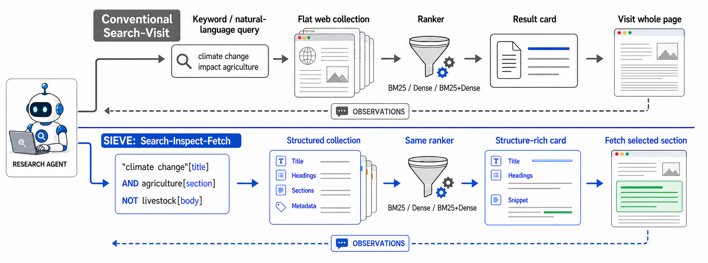
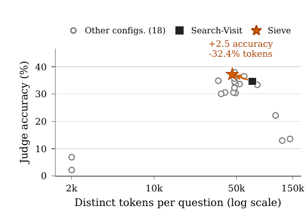
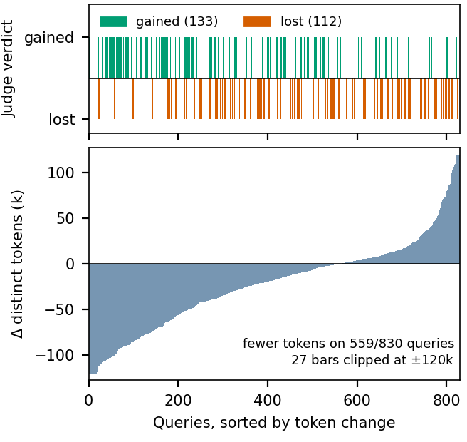
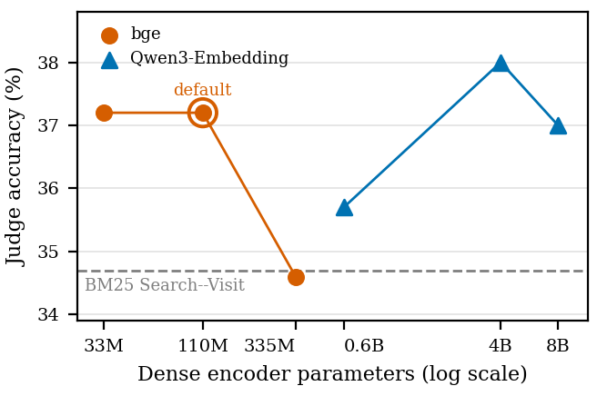

# Sieve: the Boolean-filtered search, inspect, fetch setting

Sieve is one interface setting in the SkimSearchAgent framework, the one proposed in *"Search,
Inspect, Fetch: Exploiting Boolean Retrieval for Deep-Research Agents."* It adds four separable
stages on top of the shared agent loop.

<p align="center">
  
</p>

1. **Filter.** The agent writes a BQL query: field-scoped terms (`title`, `section`, `date`,
   `infobox`, `body`), `AND`/`OR`/`NOT`, quoted phrases, prefixes. That compiles to a Lucene filter
   and *selects* the candidate set. When the filter admits nothing, a **soft fallback** relaxes to
   ranked term retrieval instead of returning an empty page (`BQL_SOFT_FALLBACK=1`, the paper
   default).
2. **Rank.** An interchangeable ranker orders only the candidates that got through: BM25, dense, or
   reciprocal-rank fusion of both.
3. **Inspect.** Each result comes back as a structure-rich card with the title, section headings,
   which fields matched, and a query-focused snippet (`SNIPPET_TOKENS`, 32 tokens by default, with
   no character cap). The agent selects what to read before spending any reading budget.
4. **Fetch.** The agent reads one named section, not the whole document.

## Running Sieve

The three ranker variants are ordinary conditions of the framework:

```bash
# Boolean-filtered BM25
python -m agent_search.evaluation.run_eval --dataset browsecomp_plus_structured_full \
  --retriever agent_research_snip --runs-dir runs/demo

# Boolean-filtered Dense
python -m agent_search.evaluation.run_eval --dataset browsecomp_plus_structured_full \
  --retriever agent_research_bql_donly_snip --runs-dir runs/demo

# Boolean-filtered BM25+Dense (the paper default)
python -m agent_search.evaluation.run_eval --dataset browsecomp_plus_structured_full \
  --retriever agent_research_bql_dense_snip --runs-dir runs/demo
```

Those three also have aliases on the `skimsearchagent` launcher: `sieve_bm25`, `sieve_dense`
and `sieve`.

## Ablation knobs

| ablation | how | paper finding |
|---|---|---|
| Strict Boolean (no fallback) | `BQL_SOFT_FALLBACK=0` | accuracy drops well below the Search-Visit baseline, so the fallback is load-bearing |
| Without snippets | condition `agent_research_bql_dense_fetch` | 2.9 to 6.8 accuracy points lost, with everything else matched |
| Snippet width sweep | `snippet_tokens=32 / 64 / 128 / 256 / 512` on the `skimsearchagent` launcher, or `SNIPPET_TOKENS=` in the environment. Default 32. It governs BOTH arms' listing snippets, Sieve's query-biased window and the visit baselines' opening window, so a sweep moves the whole comparison rather than one side of it | not yet run; listing size grows roughly linearly with the window |
| Dense encoder sweep | `DENSE_MODEL=<hf-id>` (bge-small/base/large, Qwen3-Embedding 0.6B/4B/8B) | token saving holds from 33M to 8B; accuracy moves within about 3 points |
| Ranker swap | the three conditions above | fusion wins on BrowseComp-Plus, dense wins on HotpotQA |
| Engine swap | `agent_research_indri_snip` | Indri-QL executor comparison |

## Results

<p align="center">
  
</p>
<p align="center"><em>Every method on full-corpus BrowseComp-Plus (n=830). Sieve sits on the
accuracy/cost Pareto front.</em></p>

| | |
|---|---|
|  |  |
| *Per-query wins and losses, plus the token change against Search-Visit.* | *Dense-encoder sweep (bge and Qwen3, 33M to 8B): the saving isn't an encoder artifact.* |

## Headline results

Against the BM25 Search-Visit baseline under identical budgets (5 results per search,
12,000-token reads, 32-token listing snippets on both arms, 100 steps):

| collection | accuracy (baseline → Sieve) | tokens/episode |
|---|---|---|
| HotpotQA (7,343) | 43.7 → 45.3 EM | 19.9k → 13.9k (−30.4%) |
| MuSiQue (2,409) | 26.1 → 29.2 EM | 43.0k → 21.3k (−50.6%) |
| BrowseComp-Plus full (830) | 34.7 → 37.2 judge | 68.1k → 46.0k (−32.4%) |

The effect carries across agent backbones (Qwen-AgentWorld, OpenResearcher), and the token savings
are largest where the baseline uses the most context. For the full tables, ablations and
statistics, see the paper, and [`REPRODUCING.md`](REPRODUCING.md) to regenerate them.

## Ranking invariant: Boolean filters, one model ranks

In Sieve the Boolean query (BQL) only **selects** candidates. The **order** comes from one ranking
model: corpus BM25 for `sieve_bm25`, reciprocal-rank fusion of BM25 and dense similarity for
`sieve`, and dense similarity alone for `sieve_dense`. Two rules are enforced in code so an
experiment cannot mix rankers:

1. **The 0-hit fallback ranks with the same model over the same index as the exact path.**
   When a Boolean query matches nothing, `soft_topk` builds a pool of the lexically closest
   documents plus (when a dense belief is attached) the dense side's nearest neighbours, and
   orders it with the arm's own fusion rule (`StructuralExecutor._fuse_soft`,
   `DenseOnlyStructuralExecutor._fuse_soft`). The coverage-tier fallback for a many-clause AND
   fuses within tiers by the same rule. Pool size: `BQL_SOFT_POOL` (default 100).
2. **Dense similarity always comes from the persisted embedding cache** built by
   `skimsearchagent-build-indexes --retriever dense --model <dense_model>`. The run refuses
   to start a dense arm without that cache and never encodes documents online; only the query
   is encoded, once per search call. The model is the run's `dense_model` (`--dense-model`,
   or `DENSE_MODEL`, default `BAAI/bge-base-en-v1.5`) for every dense arm, so Sieve's ranker, its
   fallback, and the dense and hybrid baselines all read the same index for the same model.

`tests/test_sieve_fallback_consistency.py` pins both rules.

## Authors

<p align="center">
  
</p>

<div align="center">

[Shuai Wang](https://shuaiwang.io)<sup>1</sup> ·
[Haodong Chen](https://donovan0243.github.io/)<sup>1</sup> ·
[Yu Yin](https://yinyubb.github.io/)<sup>1</sup> ·
[Shengyao Zhuang](https://arvinzhuang.github.io/) ·
[Bevan Koopman](https://bevankoopman.github.io/)<sup>2,1</sup> ·
[Guido Zuccon](https://ielab.io/people/guido-zuccon.html)<sup>1</sup>

<sup>1</sup>[ielab](https://ielab.io), The University of Queensland ·
<sup>2</sup>Australian e-Health Research Centre, CSIRO

</div>
